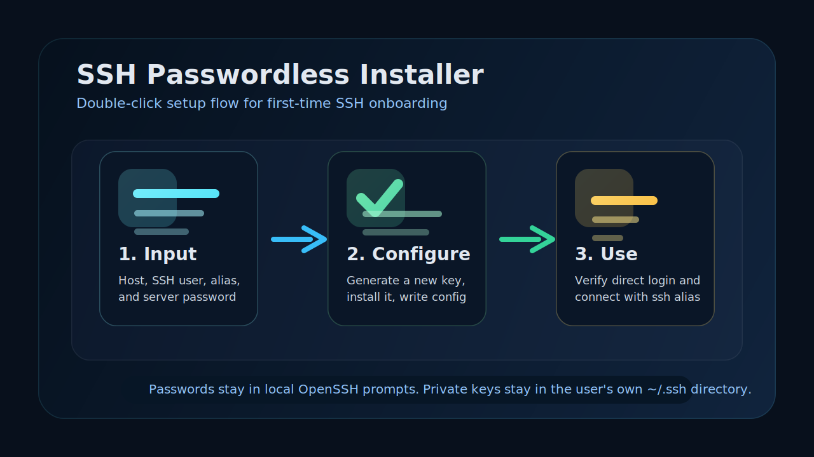

# ssh-passwordless-installer

> A double-click SSH onboarding tool for macOS and Windows. Generate a fresh key, install it on a remote server, write a safe SSH alias, and verify passwordless login in one guided flow.

<p align="center">
  
</p>

[](./LICENSE)
[](./scripts/macos)
[](./scripts/windows)
[](https://www.openssh.com/)
[](./tools_build_macos_apps.sh)

[简体中文](./README_CN.md)

## Preview



## Features

- Double-click entry points for both macOS and Windows
- Fresh Ed25519 key generation for each SSH alias
- Automatic public-key installation with `ssh-copy-id` fallback logic
- Managed `~/.ssh/config` blocks that can be safely updated per alias
- Built-in verification for both direct key login and alias login
- Release-bundle friendly structure for sharing with end users

## Tech Stack

| Layer | Technology |
|---|---|
| Local runtime | Bash, PowerShell |
| SSH operations | OpenSSH, `ssh-copy-id` |
| macOS packaging | `qlmanage`, `sips`, `iconutil`, `ditto` |
| Windows packaging | `.bat` launcher plus `.ps1` implementation |

## Quick Start

### Option 1: Run locally

#### macOS

```bash
chmod +x ./scripts/macos/setup-passwordless-ssh.command
./scripts/macos/setup-passwordless-ssh.command
```

#### Windows

Double-click:

```text
scripts\windows\setup-passwordless-ssh.bat
```

### Option 2: Build shareable release bundles

#### Build only the macOS `.app`

```bash
chmod +x ./tools_build_macos_apps.sh
./tools_build_macos_apps.sh
```

This generates:

```text
build/macos-apps/final/SSH-Passwordless-Setup-macOS.zip
```

#### Build both macOS and Windows bundles

```bash
chmod +x ./tools_build_release_bundles.sh
./tools_build_release_bundles.sh
```

This generates:

```text
build/release-bundles/final/SSH-Passwordless-Setup-macOS.zip
build/release-bundles/final/SSH-Passwordless-Setup-Windows-Download-Then-Double-Click.zip
```

### What the user is asked for

1. server IP or hostname
2. SSH username, defaulting to `root`
3. a local alias such as `vultr-root`
4. the server password

Once the flow completes, the user can connect with:

```bash
ssh vultr-root
```

## How It Works

1. collect host, username, and alias input
2. create a fresh local SSH key for that alias
3. install the public key on the remote host
4. write a managed `~/.ssh/config` block
5. verify passwordless login by both direct key and alias

## Signed macOS builds

If you want a signed and notarized macOS release, pass the optional build variables:

```bash
CODESIGN_IDENTITY="Developer ID Application: Your Name (TEAMID)" \
NOTARY_PROFILE="YOUR_NOTARY_PROFILE" \
./tools_build_macos_apps.sh
```

Without those variables, the script creates an unsigned zip suitable for local testing or internal sharing.

## Project Structure

```text
assets/
  brand/
    logo.svg
  preview/
    setup-flow.svg

docs/
  releases/
    v0.1.0.md

scripts/
  macos/
    setup-passwordless-ssh.command
  windows/
    setup-passwordless-ssh.bat
    setup-passwordless-ssh.ps1

.github/
  ISSUE_TEMPLATE/
  workflows/

tools_build_macos_apps.sh
tools_build_release_bundles.sh
```

## Security

- Server passwords are typed directly into local `ssh` or `ssh-copy-id` prompts
- Passwords are not written into the scripts, config files, or release assets
- The tool adds a new public key but does not delete older keys automatically
- Private keys remain on the user's machine under `~/.ssh/`

See [SECURITY.md](./SECURITY.md) for the disclosure guidance and safe-usage notes.

## Release Notes

- [v0.1.0](./docs/releases/v0.1.0.md)

## Contributing

Bug reports, compatibility fixes, and release improvements are welcome. Please start with [CONTRIBUTING.md](./CONTRIBUTING.md).

## License

MIT License. See [LICENSE](./LICENSE).

## Author

- X: [Mileson07](https://x.com/Mileson07)
- Xiaohongshu: [超级峰](https://xhslink.com/m/4LnJ9aB1f97)
- Douyin: [超级峰](https://v.douyin.com/rH645q7trd8/)
