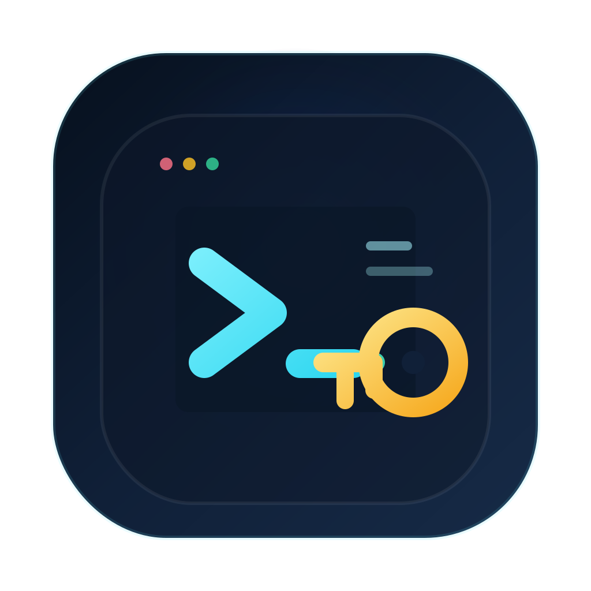
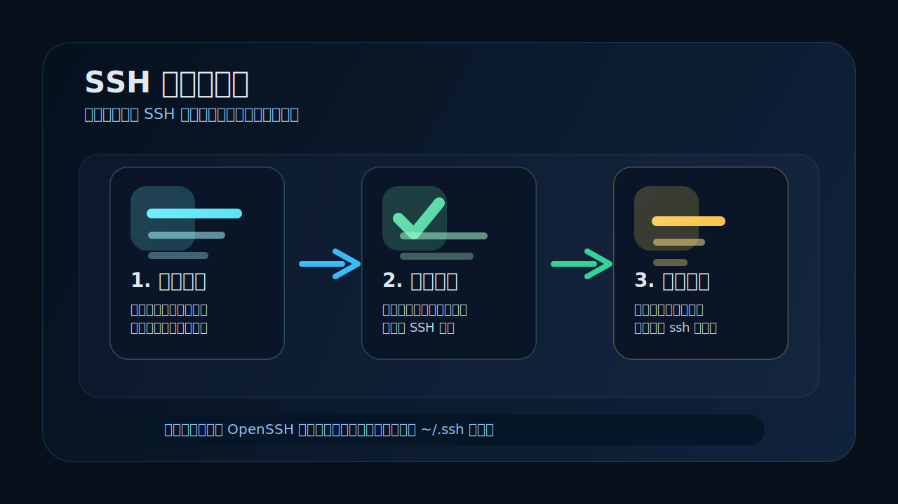

# ssh-passwordless-installer

> 给新手准备的 SSH 免密配置器：下载、双击、输入服务器信息和密码，就能完成新的免密登录配置。

<p align="center">
  
</p>

[](./LICENSE)
[](./scripts/macos)
[](./scripts/windows)
[](https://www.openssh.com/)
[](./tools_build_macos_apps.sh)

[English](./README.md)

## 预览



## 功能亮点

- macOS 和 Windows 都提供双击入口
- 为每个服务器别名生成独立的 Ed25519 密钥
- 自动把公钥安装到远端服务器
- 自动写入受控的 `~/.ssh/config` 配置块
- 自动验证直连和别名登录是否都可用
- 支持打包为可分发的 macOS `.app` 和 Windows zip

## 技术栈

| 层级 | 技术 |
|---|---|
| 本地执行 | Bash、PowerShell |
| SSH 能力 | OpenSSH、`ssh-copy-id` |
| macOS 打包 | `qlmanage`、`sips`、`iconutil`、`ditto` |
| Windows 分发 | `.bat` 启动器 + `.ps1` 主逻辑 |

## 快速开始

### 方式 1：直接本地运行

#### macOS

```bash
chmod +x ./scripts/macos/setup-passwordless-ssh.command
./scripts/macos/setup-passwordless-ssh.command
```

#### Windows

双击：

```text
scripts\windows\setup-passwordless-ssh.bat
```

### 方式 2：构建可分发安装包

#### 只构建 macOS `.app`

```bash
chmod +x ./tools_build_macos_apps.sh
./tools_build_macos_apps.sh
```

生成：

```text
build/macos-apps/final/SSH-Passwordless-Setup-macOS.zip
```

#### 同时构建 macOS 和 Windows 分发包

```bash
chmod +x ./tools_build_release_bundles.sh
./tools_build_release_bundles.sh
```

生成：

```text
build/release-bundles/final/SSH-Passwordless-Setup-macOS.zip
build/release-bundles/final/SSH-Passwordless-Setup-Windows-Download-Then-Double-Click.zip
```

### 运行时会提示输入什么

1. 服务器 IP 或域名
2. SSH 用户名，默认 `root`
3. 本地备注名，例如 `vultr-root`
4. 服务器密码

配置完成后，可以直接：

```bash
ssh vultr-root
```

## 工作流程

1. 采集服务器地址、用户名和本地别名
2. 在本机生成新的 SSH 密钥，避免复用旧密钥
3. 通过 `ssh-copy-id` 或回退逻辑安装公钥
4. 写入带标记的 `~/.ssh/config` 片段，避免污染原配置
5. 分别验证直连和别名免密登录

## macOS `.app` 签名与公证

如果需要构建签名后的 macOS 发布包，可选传入：

```bash
CODESIGN_IDENTITY="Developer ID Application: Your Name (TEAMID)" \
NOTARY_PROFILE="YOUR_NOTARY_PROFILE" \
./tools_build_macos_apps.sh
```

未提供这些变量时，脚本会生成适合测试或内部使用的未签名 zip。

## 仓库结构

```text
assets/
  brand/
    logo.svg
  preview/
    setup-flow-cn.svg
    setup-flow.svg

docs/
  releases/
    v0.1.0.md

scripts/
  macos/
    setup-passwordless-ssh.command
  windows/
    setup-passwordless-ssh.bat
    setup-passwordless-ssh.ps1

.github/
  ISSUE_TEMPLATE/
  workflows/

tools_build_macos_apps.sh
tools_build_release_bundles.sh
```

## 安全说明

- 服务器密码只会由本机 `ssh` 或 `ssh-copy-id` 读取
- 密码不会写入脚本、配置文件或仓库
- 工具只会新增新的公钥，不会自动删除旧密钥
- 私钥始终保存在用户自己的 `~/.ssh/` 目录中

更多说明见 [SECURITY.md](./SECURITY.md)。

## 版本说明

- [v0.1.0](./docs/releases/v0.1.0.md)

## 贡献

欢迎提交 bug 报告、改进建议和跨平台兼容性修复。开始贡献前请先阅读 [CONTRIBUTING.md](./CONTRIBUTING.md)。

## 许可证

MIT License，见 [LICENSE](./LICENSE)。

## 作者

- X: [Mileson07](https://x.com/Mileson07)
- 小红书: [超级峰](https://xhslink.com/m/4LnJ9aB1f97)
- 抖音: [超级峰](https://v.douyin.com/rH645q7trd8/)
